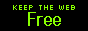
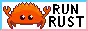

### Howdy! I’m Mat, (an aspiring engineer focused on open protocols, embedded systems, and rapid prototyping<a href="#fn-1" class="footnote-ref" title="First footnote content here">[1]</a>.)

`:where` to find<a href="#fn-2" class="footnote-ref" title="Second footnote content here">[2]</a> me

### a lil' `:about` me

A decade of technical [experience](#formative-experiences) has shaped me into an indie maker who builds engaging, accessible, and secure tools<a href="#fn-3" class="footnote-ref" title="Third footnote content here">[3]</a> for real people. I am especially passionate about search UX, decentralized infrastructure, and a safer internet.

Outside of computing, I’m also a guitarist, competition aficionado<a href="#fn-4" class="footnote-ref" title="Fourth footnote content here">[4]</a>, and linguaphile. (English, Spanish, and Esperanto)

### what i'm up to `:now`

Recently, I've been shipping a lot, (expand for stats!) but I've also been:
 
  <a href="https://heatmap.shymike.dev?id=U07VA44DNBA&timezone=America%2FNew_York&standalone=true" title="Click to view detailed data for each day!">    <picture>        <source media="(prefers-color-scheme: dark)" srcset="https://heatmap.shymike.dev?id=U07VA44DNBA&timezone=America%2FNew_York&theme=dark">            </picture></a> 

- reverse-engineering electric and bass guitar amplifiers to build:
  - LtAmp.py: a Python [library](https://pypi.org/p/ltamp) for interacting with supported amplifiers
  - The Twist: an augmentation [module](https://github.com/benderhq/the-twist/tree/nix) with features incl. remote control and preset playlists
- contributing code and technical support for [Hack Club](https://hack.club?uwu) programs incl. [Hackatime](https://hackati.me) and [HCTG](https://game.hackclub.com).

### formative `:experiences`

Since being exposed to computer programming on [Scratch](https://scratch.mit.edu) a decade ago, I’ve:
- made videogame [submissions](https://matmanna.itch.io) within 48hrs-2wks for ~7 game jams
- built a life-sized [board game](https://github.com/ldnano/o-fn) using industrial tech which supports community outreach & won:
  - 1st in the 2025 **PLCNext Innovation Contest Nationals**
  - 1st at the 2026 **Pennsylvania Invention Convention**
  - a Hack Club X Congressional App Challenge **Open-source** [**Certification**](http://congressional.hackclub.com/)
- ran AV systems (livestreams and sound mixers) for funerals and weddings
- discovered and disclosed vulnerabilities and data leaks within my school and Hack Club
- 

other miscellaneous accomplishments (not that interesting)
<ul>
  <li>Participated in the selective PennApps XXVI college [hackathon](https://pennapps.com)</li>
  <li>Received recognition for Integrity and Sportsmanship within academic competitions.</li>
  <li>Earned ~$1k in grants and prizes for personal projects submitted to Hack Club programs incl. High Seas, Summer of Making, CMD-K, and Magazine.</li></ul>
  

   
<table width="100%">
<th>Thanks for stopping by! footnotes and <code>:extra</code> things for those who care</th>
<th>README 88x31s?!</th>
<tr>
<td class="footnotes">
<ol>
<li id="fn-1">competitive environments fostered my "ship early" mentality<a href="#fnref-1" class="footnote-backref">↩</a></li>
<li id="fn-1">i normally go by <code>@matmanna</code> (or <code>@mat</code>) but please <a href="https://matmanna.dev/verify">verify</a> <a href="#fnref-1" class="footnote-backref">↩</a></li>
<li id="fn-1">i see my projects as tools meant to serve (what do i  <a href="https://matmanna.dev/use">use</a><a href="#fnref-1" class="footnote-backref">↩</a>?)</li>
<li id="fn-4">esp. trivia, having competed on a TV quizbowl and won 3rd at a regional NOSB.<a href="#fnref-4" class="footnote-backref">↩</a></li>
</ol>
</td>
<td width="210px">

<!--  -->

<!--  -->
</td>
<tr>
</table>
